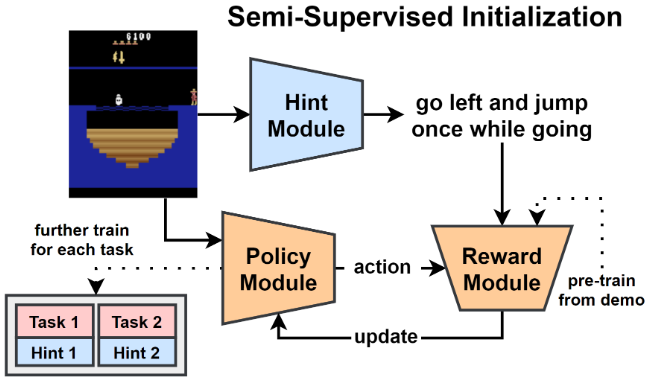

# [NAACL'21 (Short)] Semi-Supervised Policy Initialization for Playing Games with Language Hints
An implementation of SSI

[Paper](https://tsujuifu.github.io/pubs/naacl21_ssi.pdf) | [Slide](https://tsujuifu.github.io/slides/naacl21_ssi.pdf) | [Video](https://youtu.be/5UbeIKX4voY)

## Overview
SSI is an implementation of <br> 
"[Semi-Supervised Policy Initialization for Playing Games with Language Hints](https://tsujuifu.github.io/pubs/naacl21_ssi.pdf)" <br> 
[Tsu-Jui Fu](https://tsujuifu.github.io/) and [William Yang Wang](https://sites.cs.ucsb.edu/~william/) <br> 
in North American Chapter of the Association for Computational Linguistics (**NAACL**) 2021 (Short)



First, the **hint module <I>H</I> generates possible hints <I>l</I> for random states <I>s</I>**. With <I>s</I>, the policy module <I>P</I> rollouts and step actions <I>a</I>. Then, the **reward module <I>R</I> updates <I>P</I> based on the relevance between <I>a</I> and <I>l</I>**. With different <I>s</I>, <I>P</I> has the opportunity to learn from various possible hints, and **finally serves as a better-initialized policy**.

## Requirement
This code is implemented under **Python2**, [PyTorch](https://pytorch.org), and [Tensorflow](https://www.tensorflow.org/). <br>
Following libraries are also required:
+ [gym](https://gym.openai.com/)==0.10.5
+ [atari-py](https://github.com/openai/atari-py)==0.1.1

## Usage
+ Semi-Supervised Initialization (SSI)
```
python rl/ssi.py --lang_coeff=1.0 --lang_enc=onehot --model_dir=./learn_model
```
+ Task Training
```
wget http://www.cs.utexas.edu/~pgoyal/ijcai19/train_lang_data.pkl -O ./data/train_lang_data.pkl
wget http://www.cs.utexas.edu/~pgoyal/ijcai19/test_lang_data.pkl -O ./data/test_lang_data.pkl
python rl/main.py --expt_id=ID_EXPT --descr_id=ID_DESCR --lang_coeff=1.0 --lang_enc=onehot --model_dir=./learn_model
```

## Citation
```
@inproceedings{fu2021ssi, 
  author = {Tsu-Jui Fu and William Yang Wang}, 
  title = {Semi-Supervised Policy Initialization for Playing Games with Language Hints}, 
  booktitle = {North American Chapter of the Association for Computational Linguistics (NAACL)}, 
  year = {2021} 
}
```

## Acknowledgement
+ [ExtLang](https://github.com/prasoongoyal/rl-learn)
